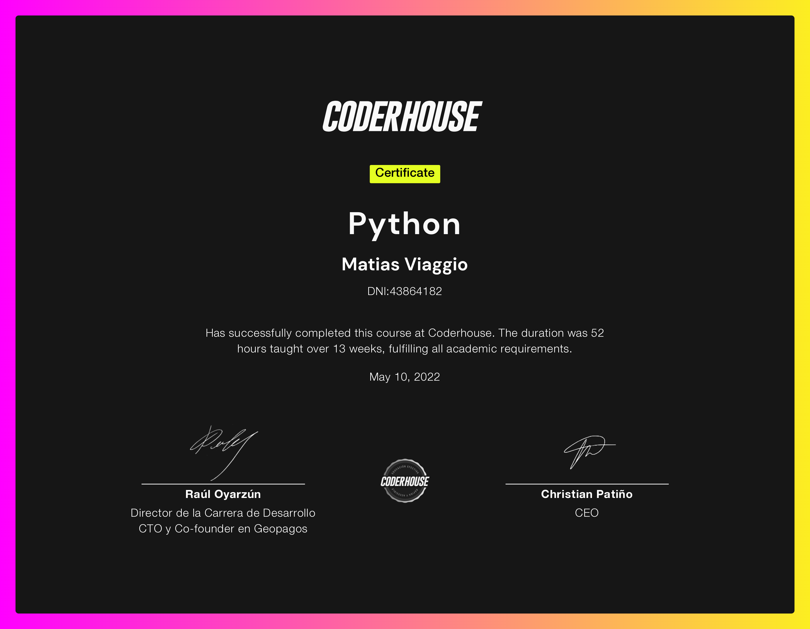

<h1 align="center">
  👨‍💻𝐇𝐞𝐥𝐥𝐨, &lt;everyone/&gt;👩‍💻!
</h1>

 
 

- 👋 Hi, I’m @mativiaggio
- 🌱 𝙸’𝚖 𝚌𝚞𝚛𝚛𝚎𝚗𝚝𝚕𝚢 study𝚒𝚗𝚐 **Information Systems Analysis and Full Stack Web Development**
- 👯 𝙸’𝚖 𝚕𝚘𝚘𝚔𝚒𝚗𝚐 𝚝𝚘 𝚌𝚘𝚕𝚕𝚊𝚋𝚘𝚛𝚊𝚝𝚎 𝚘𝚗 **𝚆𝚎𝚋 𝙳𝚎𝚟𝚎𝚕𝚘𝚙𝚖𝚎𝚗𝚝.**
       

<h2><i>A little bit about me:</i></h2>

My name is Matias and I'm a Student. I was born in Argentina, on october 25th 2001.  
My journey as a programmer started on february 2022 when I decided to take a Python and Django course. That was my first time coding. As I started the course  I also join college as a Information Systems Analysis student. 
On May 2022 I decided to go deeper in my Web Developer learning proccess, so I apply for a 1 year Full Stack course, which consist in four courses:
  

- Web Development (May 24th 2022 to July 26th 2022) 
- JavaScript (Aug 9th 2022 to Oct 4th 2022) 
- React JS (Oct 10th 2022 to Nov 24th 2022) 
- Backend PRogramming (Dec 6th 2022 to May 30th 2023)
  
<h1 align="center"><i>My Python certificate</i></h1>

  

  
<h1 align="center"><i>My Web Development certificate</i></h1>

  

